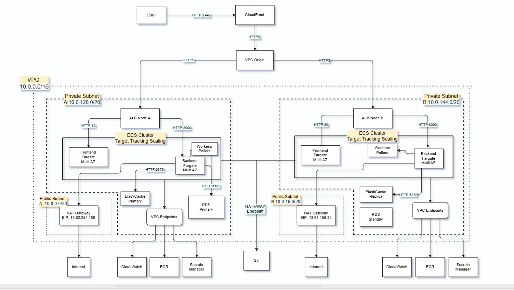

# Allegro Profit & Margin Analytics
**Portfolio project demonstrating cloud-native development on AWS.**


## Overview
Built with a business partner (accountant & Allegro seller) to track real per-order profit margins - including hidden operational costs(shipping returns, Allegro commissions, VAT adjustments) that Allegro's dashboard doesn't show.

Integrates with Allegro API via OAuth2+PKCE, ingests data asynchronously using Celery polling (webhook emulation), and calculates per-order profit after seller costs. Allegro API does not provide webhooks, so polling was implemented to emulate real-time order ingestion.

---

## Live / Demo
* **90s: [▶link]** - Architecture summary, UI, CI/CD pipeline with cache invalidation
* **5-min deep-dive: [▶link]** - Architecture walkthrough, terraform apply, OAuth2 PKCE 
  flow, UI, polling, CI/CD pipeline with cache invalidation

**Recommended:** Start with the 90s video, 
Then check Code Highlights below.

---

## Tech Stack
* **Cloud (AWS):** VPC, ECS Fargate, ECR, ALB, CloudFront (with VPC Origin), RDS (PostgreSQL), Secrets Manager, IAM, CloudWatch, NAT Gateway, VPC Endpoints, ElastiCache
* **DevOps:** Terraform, Docker, GitHub Actions, Git
* **Backend:** Python (Django DRF), Celery, Redis, OAuth2 (PKCE)
* **Frontend:** React, Nginx, JavaScript

---

## Architecture


- **Infrastructure as Code using Terraform (~68 resources)** divided into modules: Networking, Compute, Scaling, Security and Observability
- **Target Tracking Scaling** for Frontend, Backend, and workers; poller runs as a single instance to avoid concurrent cursor reads on the same stream.
- **CloudFront** is the sole entry point - ALB and ECS tasks have no public access.
- **Multi-AZ** deployment across two private subnets with ElastiCache replica and RDS Standby.
- **ElastiCache** (Valkey) for caching layer, Redis for Celery broker

---

## Local Development
> Repository is private. Demo available in the video above.

---

## Code Highlights
- [Secrets_Manager.tf](./Terraform/Secrets_Manager.tf) - No hardcoded secrets; everything is generated dynamically
`````terraform
resource "aws_secretsmanager_secret_version" "terraform_generated" {
  secret_id     = aws_secretsmanager_secret.terraform_generated.id
  secret_string = jsonencode(merge(
    jsondecode(data.aws_secretsmanager_secret_version.manual.secret_string),
    {
      # RDS credentials
      db_username = var.db_username
      db_password = random_password.db_password.result
`````

- [entrypoint.sh](./Backend/entrypoint.sh) - DB readiness check without netcat or postgresql-client
```bash
# Simplified
while ! python -c "
    aws_secrets = json.loads(os.environ.get('secrets_json', '{}'))
    s.connect((aws_secrets.get('db_host'), aws_secrets.get('db_port', 5432)))
" > /dev/null 2>&1; do
    sleep 4
done
```

- [setup_allegro_cred.py](./Backend/allegro_app/management/commands/setup_allegro_cred.py) - Idempotent credential seeding from Secrets Manager
``````python
# Simplified
# Safe to run on every container startup — create or update, never duplicate
@transaction.atomic
def handle(self, *args, **options):
  obj, created = AllegroCredentials.objects.get_or_create(id=1)
  obj.client_id = client_id
  obj.set_client_secret(client_secret) # Fernet-encrypted at model level
  obj.save()
``````


- [OAuth2/models.py](./Backend/allegro_app/OAuth2/models.py) - Fernet encryption at the model level, not the application level
``````python
class AllegroCredentials(models.Model):
     encrypted_client_secret = models.CharField(max_length=512)

    def set_client_secret(self, secret: str) -> None:
        """Encrypt and store the client secret."""
        self.encrypted_client_secret = settings.PRIMARY_FERNET.encrypt(secret.encode()).decode()

    def get_client_secret(self) -> str:
        """Decrypt and return the client secret."""
        return settings.FERNET.decrypt(self.encrypted_client_secret.encode()).decode()
``````

- [OAuth2/services.py](./Backend/allegro_app/OAuth2/services.py) - Validation before use - fail fast instead of a silent error
``````python
    @staticmethod
    def require_client_secret(creds: AllegroCredentials) -> str:
        secret = creds.get_client_secret().strip()
        if not secret:
            raise ValueError("Allegro client_secret is missing. Update Allegro credentials in Django Admin.")
        return secret
``````

---

## CI/CD
**CI/CD Flow:**

**Frontend:** `GitHub Actions` ➔ `Docker Build` ➔ `Amazon ECR` ➔ `ECS (versioned)` ➔ `CloudFront Invalidation`

**Backend:** `GitHub Actions` ➔ `Docker Build` ➔ `Amazon ECR` ➔ `ECS (versioned)`

**Container Entrypoint:**
`Wait for DB` ➔ `Migrations` ➔ `Seeding data` ➔ `App Ready`

---

## Scaling Strategy
* ECS Service Auto Scaling (CPU / Memory based)
* ALB distributes traffic across tasks
* CloudFront reduces origin load
* ElastiCache reduces database pressure

---

## Security
* No public access to ECS or ALB - traffic enters only via CloudFront
* Secrets stored in AWS Secrets Manager - no hardcoded credentials, 
  dynamically generated by Terraform
* Private subnets for compute
* VPC Endpoints for ECR, CW and Secrets Manager - no internet traversal 
  for sensitive operations
* Fernet encryption for third-party API credentials at the model level

---

## Design Evolution
Started as a learning project built for a business partner. Developed and iterated on **Render** for 3-4 months, then migrated to **AWS** after completing AWS certifications (CCP, DVA).

Initial infrastructure was provisioned manually via AWS Console - after ~20 hours, complexity and configuration drift made it unmanageable. Rebuilt from scratch; the second iteration worked but remained hard to reproduce. This drove the migration to **Terraform**, which resolved reproducibility and became the foundation for the final Multi-AZ Fargate architecture.

---

## Possible Improvements
* Add SQS for async processing — currently using a custom database-backed queue (PostgreSQL) with idempotent enqueue, worker locking, retry backoff, and dead-letter semantics. SQS would offload queue pressure from the database and provide managed delivery guarantees at scale.
* Add WAF for edge protection
* Add Run Migrations Task in CI/CD — current setup has a potential race condition when multiple tasks start simultaneously before migrations complete
* Add distributed tracing (X-Ray)
* Add unit tests - priority: margin calculation logic and Fernet encryption paths
* Implement blue/green deployments

---

## Author
Łukasz Sanecki