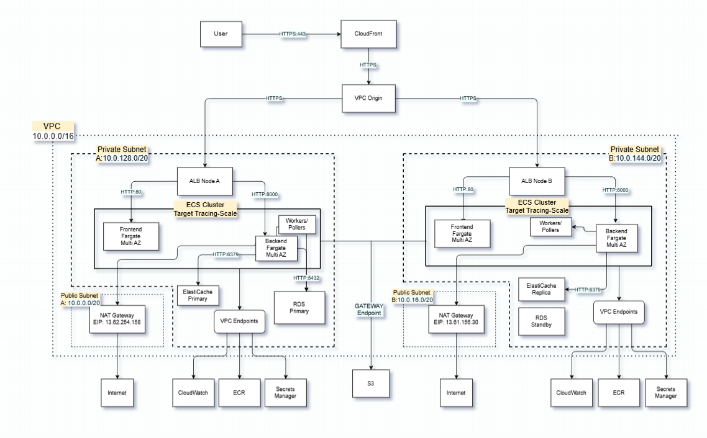
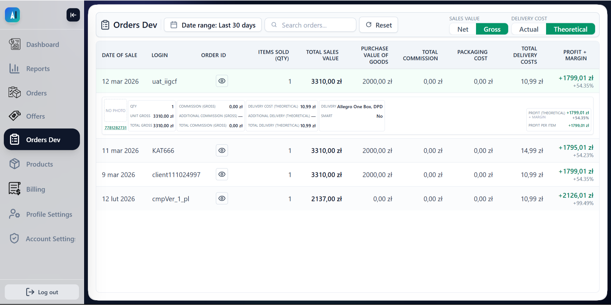

# Allegro Profit & Margin Analytics – Cloud-Native Portfolio Project

## Overview
Built with a business partner (accountant & Allegro seller) to track real per-order profit margins - including hidden operational costs(shipping returns, Allegro commissions, VAT adjustments) that Allegro's dashboard doesn't show.

Integrates with Allegro API via OAuth2+PKCE, ingests order data asynchronously using Celery polling (webhook emulation), and calculates per-order profit after seller costs. Allegro API does not provide webhooks, so polling was implemented to emulate real-time order ingestion.

*Portfolio project demonstrating cloud-native development on AWS.*

---

## Live / Demo
* **90s: [▶link]** - Architecture summary, UI, CI/CD pipeline with cache invalidation
* **5-min deep-dive: [▶link]** - Architecture walkthrough, terraform apply, OAuth2 PKCE 
  flow, UI, polling, CI/CD pipeline with cache invalidation

**Recommended:** Start with the 90s video, 
then check Code Highlights below.

---

## Tech Stack
* **Cloud (AWS):** VPC, ECS Fargate, ECR, ALB, CloudFront (with VPC Origin), RDS (PostgreSQL), Secrets Manager, IAM, CloudWatch, NAT Gateway, VPC Endpoints, ElastiCache
* **DevOps:** Terraform, Docker, GitHub Actions, Git
* **Backend:** Python (Django DRF), Celery, Redis, OAuth2 (PKCE)
* **Frontend:** React, Nginx, JavaScript

---

## Architecture & UI

---

## Code Highlights
- [entrypoint.sh](./Backend/entrypoint.sh) - Ensures DB is ready, and then runs migrations
- [setup_allegro_cred.py](./Backend/allegro_app/management/commands/setup_allegro_cred.py) - Idempotent credential seeding from Secrets Manager
- [Secrets_Manager.tf](./Terraform/Secrets_Manager.tf) - No hardcoded secrets; everything is generated dynamically
- [OAuth2/models.py](./Backend/allegro_app/OAuth2/models.py) - Fernet encryption at the model level, not the application level
- [OAuth2/services.py](./Backend/allegro_app/OAuth2/services.py) - Validation before use - fail fast instead of a silent error

---

## Key Features
- Infrastructure as Code using Terraform (~68 resources) divided into modules: Networking, Compute, Scaling, Security, and Observability
- OAuth2 + PKCE login flow with Allegro
- Idempotent data ingestion via polling
- Per-order margin calculation with cost breakdown
- Asynchronous processing with Celery workers
- Fernet-encrypted credential storage

---

## CI/CD
**CI/CD Flow:**

**Frontend:** `GitHub Actions` ➔ `Docker Build` ➔ `Amazon ECR` ➔ `ECS (versioned)` ➔ `CloudFront Invalidation`

**Backend:** `GitHub Actions` ➔ `Docker Build` ➔ `Amazon ECR` ➔ `ECS (versioned)`

**Container Entrypoint:**
`Wait for DB` ➔ `Migrations` ➔ `Seeds` ➔ `App Ready`

---

## Scaling Strategy
* ECS Service Auto Scaling (CPU / Memory based)
* ALB distributes traffic across tasks
* CloudFront reduces origin load
* ElastiCache reduces database pressure

---

## Security
* No public access to ECS or ALB - traffic enters only via CloudFront
* Secrets stored in AWS Secrets Manager - no hardcoded credentials, 
  dynamically generated by Terraform
* Private subnets for compute
* VPC Endpoints for ECR, CW and Secrets Manager - no internet traversal 
  for sensitive operations
* Fernet encryption for third-party API credentials at the model level

---

## Design Evolution
The project was developed iteratively. Evolved from local Docker-Compose to **Render**, eventually migrating to **AWS**. 
Initial EC2 deployments were refactored into a high-availability Fargate Multi-AZ architecture. 
This transition addressed real-world trade-offs between management overhead, cost optimization, and infrastructure resilience using Terraform.

---

## Possible Improvements
* Add SQS for async processing
* Add unit tests
* Add Run Migrations Task in CI/CD to avoid a potential race condition
* Add WAF for edge protection
* Add distributed tracing (X-Ray)
* Implement blue/green deployments

---

## Author
Łukasz Sanecki