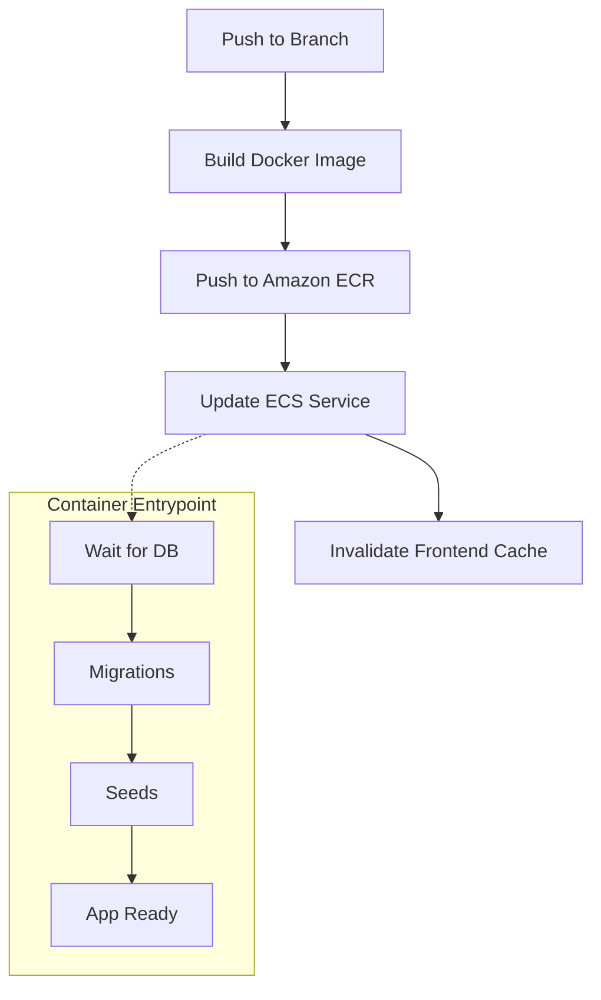

# Cloud-native Profit & Margin Analytics SaaS

## Overview
An app for Allegro sellers to track margins and profitability - integrates with the Allegro API (OAuth2 + PKCE), retrieves order data, and calculates profit after costs.

The most challenging part was designing a reliable data ingestion flow using polling and asynchronous processing to emulate webhooks while ensuring idempotency and consistency.

*Developed in collaboration with a stakeholder (professional accountant & Allegro seller) to reflect real-world use cases.*

---

## Architecture & UI

---

## Code Highlights
[entrypoint.sh](./Backend/entrypoint.sh) - Automated AWS migrations & startup
[setup_allegro_cred.py](./Backend/allegro_app/management/commands/setup_allegro_cred.py) - Idempotent seeding with Secrets Manager
[Secrets_Manager.tf](./Terraform/Secrets_Manager.tf) - Dynamic secret management
[OAuth2/models.py](./Backend/allegro_app/oauth2/models.py) - Fernet encryption - model layer
[OAuth2/services.py](./Backend/allegro_app/oauth2/services.py) - Fernet encryption - service layer
---

## Live / Demo
90s: [▶link]
5-min deep-dive: [▶link]

---

## Tech Stack
* **Cloud (AWS):** VPC, ECS Fargate, ECR, ALB, CloudFront (with VPC Origin), RDS (PostgreSQL), Secrets Manager, IAM, CloudWatch, NAT Gateway, VPC Endpoints, ElastiCache.
* **DevOps:** Terraform, Docker, GitHub Actions, Git.
* **Backend:** Python (Django DRF), Celery, Redis, OAuth2 (PKCE).
* **Frontend:** React, Nginx, JavaScript

---

## Key Features
- Cloud-native architecture on AWS (ECS Fargate + CloudFront + private networking)
- Infrastructure as Code using Terraform (~68 resources) divided into modules: Networking, Compute, Scaling, Security, and Observability
- Asynchronous processing with Celery workers
- Secure secrets management (AWS Secrets Manager + Fernet encryption)
- CI/CD pipeline using GitHub Actions
- Multi-AZ high availability setup

---

## CI/CD
GitHub Actions pipeline:

Includes:
* Image versioning
* Automated deployments

---

## Scaling Strategy
* ECS Service Auto Scaling (CPU / Memory based)
* ALB distributes traffic across tasks
* CloudFront reduces origin load
* ElastiCache reduces database pressure

---

## Security
* No public access to ECS or ALB
* Traffic enters only via CloudFront
* Secrets stored in AWS Secrets Manager
* Private subnets for compute
* VPC Endpoints reduce internet exposure

---

## Design Evolution
The project was developed iteratively, starting from a local environment and gradually migrating to AWS.

The project evolved from local Docker-Compose to Render, eventually migrating to AWS. Initial EC2 deployments were refactored into a high-availability Fargate Multi-AZ architecture. This transition addressed real-world trade-offs between management overhead, cost optimization, and infrastructure resilience using Terraform.

---

## Possible Improvements
* Add SQS for async processing
* Add unit tests
* Add Run Migrations Task in CI/CD to avoid a potential race condition
* Add WAF for edge protection
* Add distributed tracing (X-Ray)
* Implement blue/green deployments

---

## Author
Łukasz Sanecki